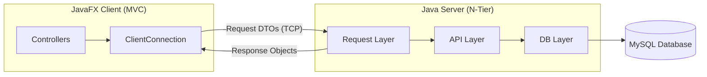

# I-Wish Application: Technical Documentation

## 1. Overview

I-Wish is a Java-based wishlist management application with a client-server architecture. It allows users to create and manage wishlists, add items, manage friendships, and track contributions from friends towards wishlist items.

---

## 2. System Architecture

### 2.1 High-Level Overview

The application follows a **Client-Server model** communicating over raw TCP sockets.



---

### 2.2 Back-End: N-Tier (3-Tier) Architecture

The server-side is designed around a classic 3-tier architecture, promoting separation of concerns and testability.

| Tier | Responsibility | Key Classes |
|---|---|---|
| **1. Request Layer** | Handles incoming TCP connections, reads/writes serialized objects. Analogous to a web server like Nginx. | `Server.java`, `ClientHandler.java` |
| **2. API Layer** | Contains all business logic. Routes `Request` DTOs to the correct handler and orchestrates calls to the DB layer. | `RequestRouter.java`, `UserApis.java`, `FriendsApis.java`, `ContributionApis.java`, etc. |
| **3. DB Layer** | Data Access Objects (DAOs). Responsible for all direct interactions with the MySQL database via JDBC. | `DBHandler.java`, `UsersHandler.java`, `WishListHandler.java`, `FriendsHandler.java`, etc. |

---

### 2.3 Front-End: JavaFX Client

The client is a standalone JavaFX application that follows the **MVC (Model-View-Controller)** pattern.

| Component | Responsibility | Location |
|---|---|---|
| **Model** | Data structures shared between client and server. | `iwish-common` module (`models/`, `dtos/`) |
| **View** | FXML layout files and CSS stylesheets. | `iwish-client/.../resources/views/` |
| **Controller** | Handles UI events, updates views, and communicates with the server. | `iwish-client/.../controllers/` |

---

## 3. Design Patterns

### 3.1 Back-End Patterns

#### Observer Pattern
The server can push notifications to clients asynchronously. The client's `ClientConnection` class implements a listener thread that waits for incoming objects.
- **Subject**: The Server, which can write `NotificationDto` objects to any client's output stream.
- **Observer**: The `ClientConnection.startListening()` thread, which reacts to incoming notifications by updating the UI via `Platform.runLater()`.

```java
// In ClientConnection.java (Observer)
private void startListening() {
    listenerThread = new Thread(() -> {
        while (running) {
            Object msg = in.readObject();
            if (msg instanceof NotificationDto) {
                Platform.runLater(() -> ToastManager.show((NotificationDto) msg));
            }
            // ...
        }
    });
}
```

#### Singleton Pattern
Core server components are initialized once and shared.
- `DBHandler`: Manages the single database connection pool.
- All `*Handler` DAOs in `RequestRouter`: Instantiated once in a `static` block and reused for all requests.

```java
// In RequestRouter.java (Singleton-like static initialization)
static {
    usersHandler = new UsersHandler();
    friendsHandler = new FriendsHandler();
    // ... other handlers
}
```

---

### 3.2 Front-End Patterns

#### MVC (Model-View-Controller)
JavaFX is inherently an MVC framework.
- **Model**: `User.java`, `WishList.java`, `Item.java` (in `iwish-common`).
- **View**: `dashboard.fxml`, `login.fxml`.
- **Controller**: `DashboardController.java`, `LoginController.java`.

#### Facade Pattern
Complex subsystems are hidden behind simple interfaces.

| Facade | Hides | Public Interface |
|---|---|---|
| `IWishManager` | Scene loading, primary stage access, session state (logged-in user). | `switchScene(name, title)`, `getLoggedUser()`, `logout()` |
| `ClientConnection` | Socket management, threading, request/response correlation. | `connect(host, port)`, `sendAndWait(request)`, `close()` |

---

## 4. Database Schema

The `iwish` database consists of the following tables:

| Table | Description | Key Columns |
|---|---|---|
| `User` | User accounts. | `user_id`, `username`, `password`, `balance` |
| `Wishlist` | A user's wishlist. One-to-one with User. | `wishlist_id`, `user_id` |
| `Item` | Catalog of available items. | `item_id`, `name`, `price`, `description` |
| `Wishlist_Item` | Junction table linking wishlists to items. | `rec_id`, `wishlist_id`, `item_id`, `quantity` |
| `Friends` | Manages friend relationships. | `user1_id`, `user2_id`, `status` (pending/accepted) |
| `Contribution` | Tracks contributions to a wishlist item. | `wishlist_item_id`, `contributor_id`, `amount` |
| `Notification` | Stores user notifications. | `notification_id`, `user_id`, `title`, `body`, `is_read`, `cleared` |

---

## 5. Request-Response Protocol

Communication uses serialized Java objects (`ObjectOutputStream` / `ObjectInputStream`).

**Flow:**
1.  Client creates a `Request` DTO (e.g., `LoginRequest`).
2.  Client calls `clientConnection.sendAndWait(request)`.
3.  Server's `ClientHandler` receives the object.
4.  `RequestRouter.handleRequest()` dispatches to the correct `*Apis` method.
5.  The API method executes business logic, calling `*Handler` DAOs as needed.
6.  A response object is returned to the client.

---

## 6. Feature Spotlight: Notification System v2.0

### Soft Delete Mechanism
- **Database**: The `Notification` table has a `cleared` boolean column.
- **Logic**: "Deleting" a notification sets `cleared = TRUE`. Queries filter by `cleared = FALSE`.

### Right Sidebar Synchronization
- **Real-time Updates**: Actions on the main tab automatically refresh the sidebar.
- **Smart Dismissal**: Clicking 'X' marks as read, soft-deletes, and triggers a fade-out animation.

---

## 7. Running the Application

### Prerequisites
- JDK 11+, Maven 3.8+, MySQL Server.

### Setup
1.  Run `DataBaseInitializationScript` in MySQL.
2.  Create `db.properties` in `iwish-server/src/main/resources/`.

### Commands
```bash
cd iwish
mvn clean install

# Terminal 1: Server
cd iwish-server && mvn javafx:run

# Terminal 2: Client
cd iwish-client && mvn javafx:run
```

---

## 8. Troubleshooting

| Problem | Solution |
|---|---|
| "Duplicate foreign key constraint name" | Ensure the DB script runs completely with `DROP TABLE` statements. |
| "Failed to open referenced table" | Check table name casing consistency. |
| "Connection refused" on client | Ensure the server is running on port 5005 first. |
| No `db.properties` file | Create it in `iwish-server/src/main/resources/` with your DB credentials. |